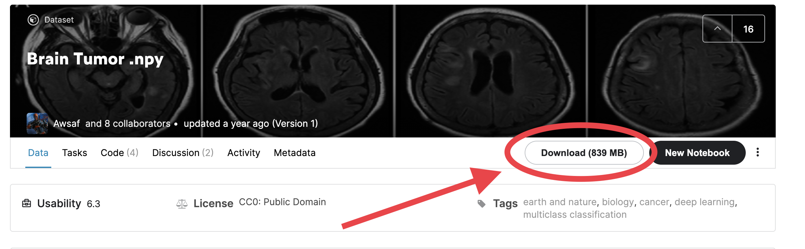
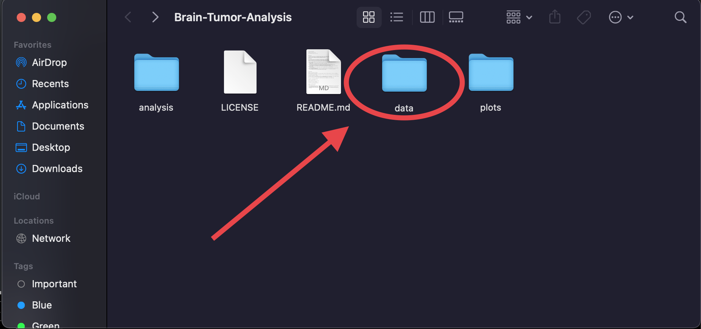
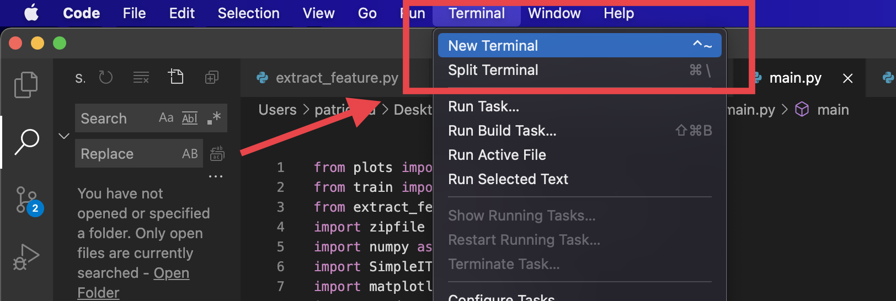
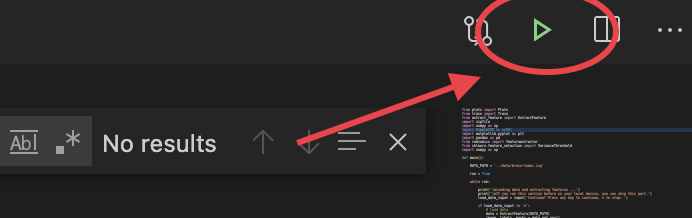

# Brain-Tumor-Analysis

CSE163 final project, Wi '21

By: Tommy Chung, Patrick Liu, Yi Jin

#### Purpose:

The purpose of this project is to identify different types of brain tumors through radiometric analysis, machine learning, and deep learning and showing the results with visuals. The field of radiomics takes a quantititative approach to medical imaging by using advanced mathematical analysis. 

#### Approach:

The three main brain tumors we analyzed were meningioma tumors, glioma tumors, and pituitary tumors. We started with a zip file that included a file with images, a file for the tumor masks, and a file for brain tumor labels, all in a numpy array format. In total, there were exactly 3064 images we could work with. Listed below are the steps for our analysis. To run the analysis, follow the instructions  [here](#Instructions)

- Extract the numpy images, masks, and labels file from zip file using python's built in zip file extractor.
- Use the pyradiomics library to extract radiomic features and save as a csv file.
- Generate visuals:
  - Create bar plot to show how many counts of each tumor is in the data.
  - Create 3 plots, each showing one of each type of tumor and their tumor mask.
- Use a decision tree classifier to train the models in three different ways to analyze their accuracies:
  - Train the model with tree height one to tree height thrity and plot each prediction accuracy
  - Train the model with five features to 65 features and plot each prediction accuracy
  - Train the model with five leaf nodes to 200 leaf nodes, increasing by five leaves each iteration and plot each prediction accuracy
  - Train the model to predict category labels to their true labels and plot a confusion matrix.
  - Plot a matrix graph
  - Plot an importance features graph. Features that are important have an imortance value of 0.05 or above, and this value is calculated mathematiacally.
  - Use a multilayer perception model to train data to predict which label is in a given brain tumor scan.
  - Plot the image scan with a the predicted label and the true label.

We also made the modules user friendly so users can choose to skip some steps, such as extracting features , if they already ran the program once. This will allow the user to save some time.

# Instructions

##### Setup

- First, download the brain tumor zip file from [kaggle](https://www.kaggle.com/awsaf49/brain-tumor)

-  [Change](https://help.gnome.org/users/gnome-help/stable/files-rename.html.en) the file name to 'brain-tumor.zip'

- Clone the repo and go to the directory by running `cd Brain-Tumor-Analysis`, add the 'brain-tumor.zip' file into the 'data' folder

  

##### Installing external libraries

Because this project uses libraries not included in python, we have to install some. Here is the list of commands to run to be able to run the project. Open up VS Code, and open a new terminal. 

Run the following commands in the new terminal.

First, check the version of python by running`python --version` If your version is less than 3.0, go to [here](https://www.python.org/downloads/) to update.

Then check to see if you have pip installed. Pip is the package manager we will be using. Run  `pip --version`. If you get an error message, go to [here](https://pip.pypa.io/en/stable/installing/) to install pip.

Then install [VS Code](https://code.visualstudio.com/download)

After this, we can install all the external libraries. Open up VS Here are the commands to run to install them.

Pyradiomics: `pip install pyradiomics`

Pandas: `pip install pandas`

Numpy and matplotlib: `pip install numpy`

SimpleITK: `pip install SimpleITK`

Scikit-learn: `pip install scikit-learn`

Seaborn: `pip install seaborn`

##### Running the program

​	To run the program, go to the analysis directory by running `cd Brain-Tumor_Analysis` to go into the cloned repository and then cd `analysis` to go into the analysis folder. Then, type `open .` and open the file in VS Code. Lastly, click the green run button in the top left.  

And that's it, the plots will save in the plots folder after running so you can view them there.